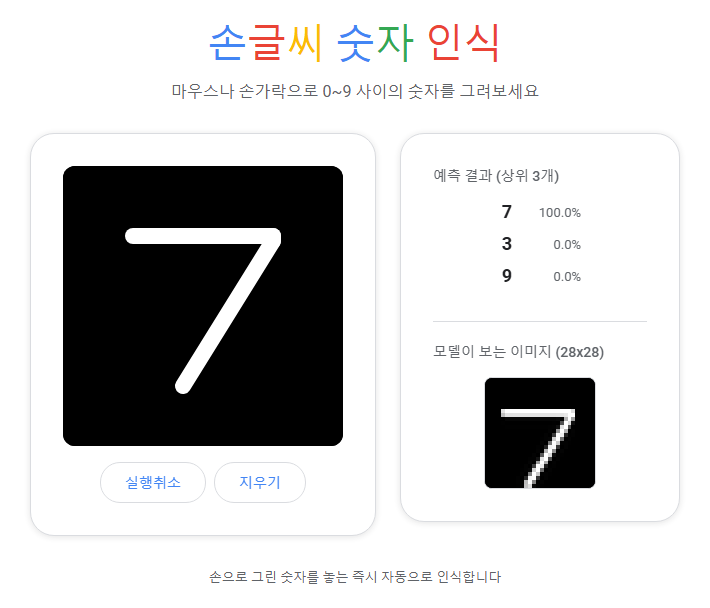

<!-- Created: 2026-08-16 22:26 -->

# ✍️ 손글씨 숫자 인식
### Handwritten Digit Recognizer

마우스나 손가락으로 그린 숫자를 신경망이 실시간으로 인식합니다

  

## 📌 소개

[MNIST](https://en.wikipedia.org/wiki/MNIST_database) 데이터셋으로 학습한 신경망을 이용해, 캔버스에 그린 숫자(0~9)를 실시간으로 인식하는 프로젝트입니다. 같은 모델과 전처리 방식을 각각 **데스크톱 GUI**와 **웹 앱** 두 가지 형태로 독립적으로 구현했습니다.

## ✨ 주요 기능

- 🖱️ 캔버스에 숫자를 그리고 손을 떼면 버튼 없이 **자동 인식**
- 📊 웹 버전은 **상위 3개 예측 확률**을 막대그래프로 표시
- 🔍 모델이 실제로 보는 **28x28 전처리 이미지**를 그대로 미리보기
- ↩️ 웹 버전은 획 단위 **실행취소** 지원
- 🎯 MNIST 60,000장 학습, 테스트 정확도 **97.8%**

## 🧩 두 가지 버전

|  | 🖥️ 데스크톱 버전 | 🌐 웹 버전 |
|---|---|---|
| 기술 | Python + Tkinter | Python + Flask + HTML5 Canvas |
| 실행 방법 | 로컬에서 GUI 앱 실행 | 로컬 서버 실행 후 브라우저 접속 |
| 문서 | [`desktop_version/README.md`](desktop_version/README.md) | [`web_version/README.md`](web_version/README.md) |

두 버전은 코드를 공유하지 않는 완전히 독립된 구현이며, 각 폴더에 자체 학습 스크립트와 학습된 모델 파일을 갖고 있습니다.

## ⚙️ 동작 원리

1. MNIST 60,000장으로 `scikit-learn`의 `MLPClassifier`(은닉층 256 → 128)를 학습시켜 테스트 정확도 약 97.8%를 달성합니다.
2. 사용자가 그린 이미지는 실제 MNIST 데이터와 같은 방식으로 전처리됩니다: 잉크가 있는 영역만 잘라낸 뒤, 가로세로 비율을 유지하며 20x20 크기로 스케일하고, 무게중심을 기준으로 28x28 프레임 한가운데에 배치합니다. 단순히 그림 전체를 28x28로 축소하면 학습 데이터와 분포가 달라져 인식률이 크게 떨어지기 때문입니다.
3. 그리기를 멈추는 순간(마우스/터치를 떼는 순간) 별도의 버튼 없이 자동으로 예측 결과와 신뢰도(%)를 보여줍니다.

## 🚀 시작하기

각 버전의 자세한 설치·실행 방법은 아래 문서를 참고하세요.

- 🖥️ [데스크톱 버전 실행 방법](desktop_version/README.md)
- 🌐 [웹 버전 실행 방법](web_version/README.md)
